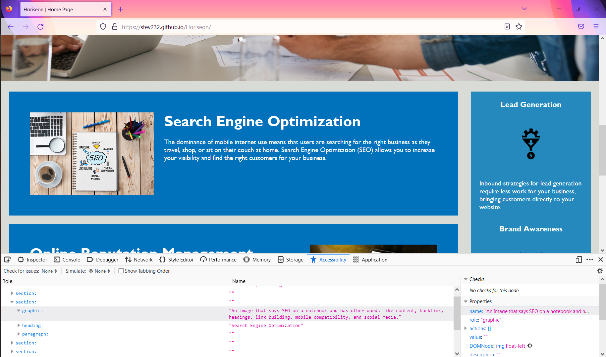
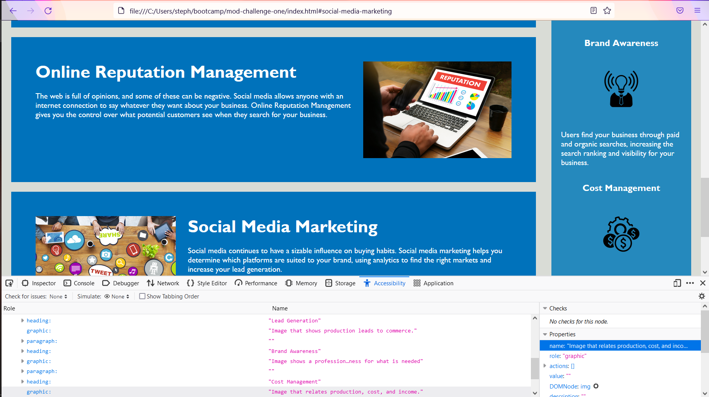

# Module One Challenge

## Description

Horiseon is a media management and improvement company. The goals are to provide information on Search Engine Optimization (SEO), Online Reputation Management and Social Media Marketing. The top nav bar includes navigation to each section in our homepage to describe our services. In this project I use IDs to reference to the nav bar linking and I improved accessibility by adding alt texts to images.
I also added documentation and moved elements and classes around in the style sheet.

## ScreenShots

Image that displays an accessibility alt that was added to an image.

Image that displays alts for the aside images.

## Deployment link

https://stev232.github.io/Horiseon/